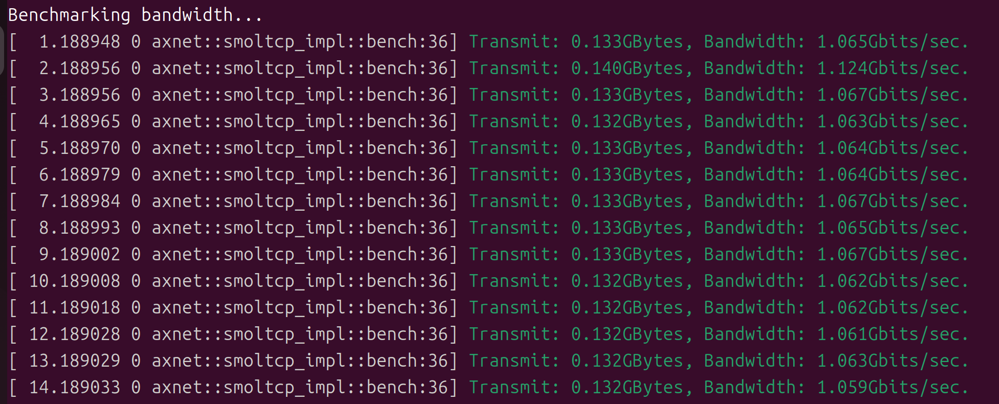
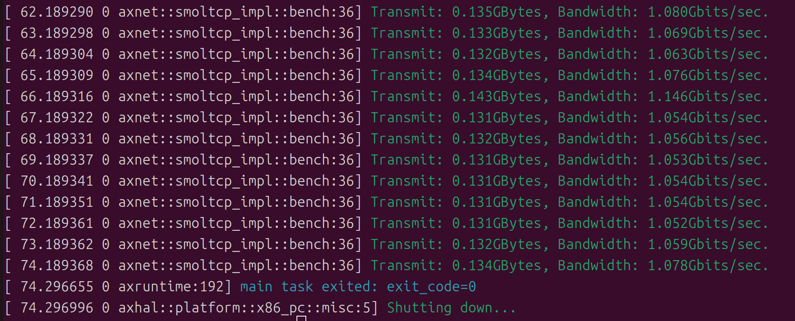
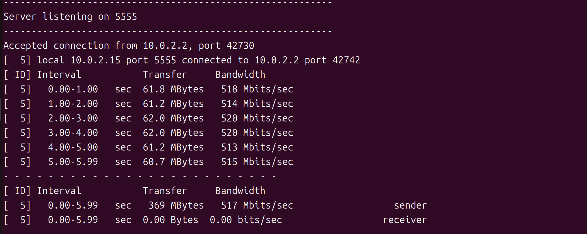
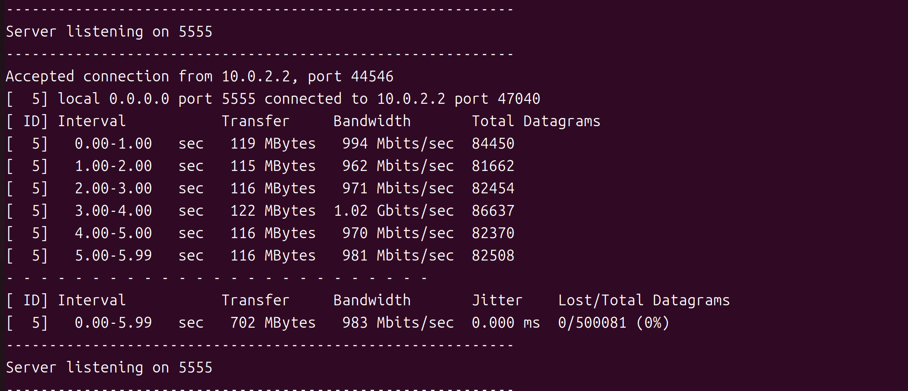
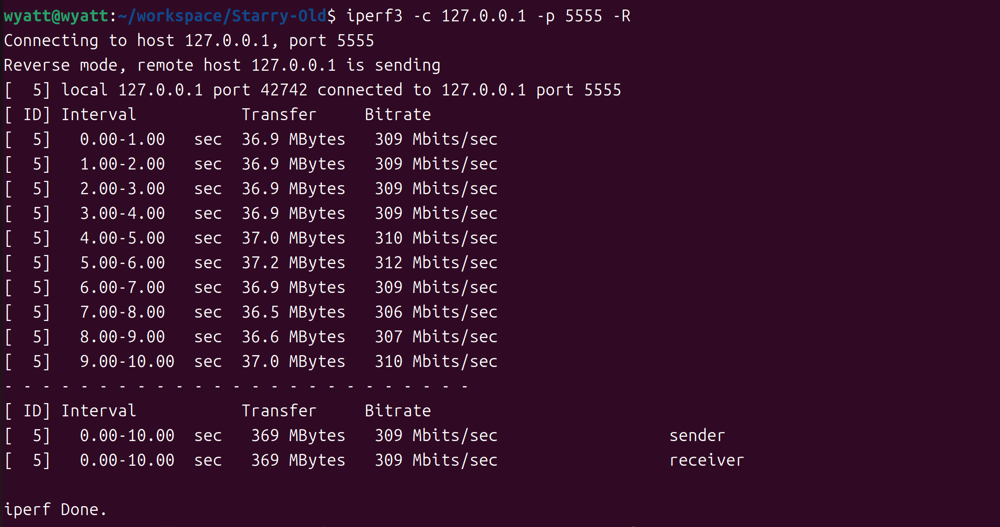
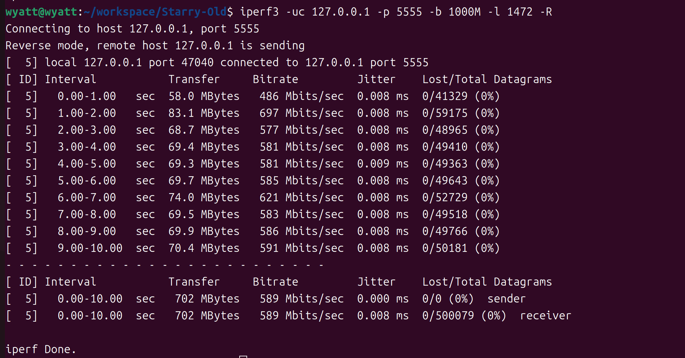

starry-os中有提供现成的apps来帮助测试
### 1.接口层
```
make A=apps/net/bwbench SMP=1 NET=y LOG=debug run
```
通过上述指令调用测试函数发送10G的已经封装为以太网帧的测试数据，其中NET=y的配置选项负责编译协议栈，在qemu中启用虚拟网络设备


传输10G总共用时73秒，传输速率140MB/s
### 2.传输层
**发送端**：
```
make A=apps/c/iperf SMP=1 NET=y BLK=y ARCH=x86_64 LOG=error run
```
tcp：  

udp：

**接收端**：
```
iperf3 -c 127.0.0.1 -p 5555 -R
```

```
iperf3 -uc 127.0.0.1 -p 5555 -b 1000M -l 1472 -R
```


其中在编译iperf的时候出现交叉编译工具musl-ar的缺失
解决方案：musl.cc下载x86_64-linux-musl-cross.tgz，其中包含这部分工具

